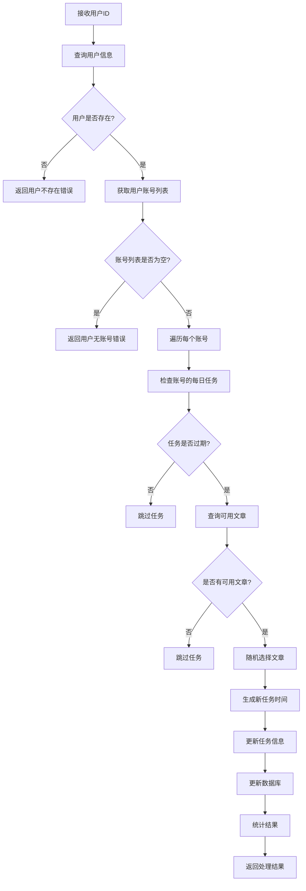

# 创建每日任务云函数

## 概述

`create-daily-tasks` 云函数用于根据用户 ID 自动创建和更新每日任务，确保用户账号的每日任务始终保持最新状态。

## 功能特性

### 1. 智能任务管理

- **自动检查**: 自动检查用户所有账号的每日任务状态
- **过期识别**: 识别已过期的任务并自动更新
- **时间优化**: 为过期任务安排新的执行时间

### 2. 文章智能分配

- **任务完成检查**: 先检查任务是否已完成
- **继续原任务**: 未完成的任务继续使用原文章
- **分配新文章**: 已完成的任务分配新文章
- **赛道匹配**: 根据账号赛道类型选择合适文章
- **去重机制**: 排除已发布的文章，避免重复
- **随机选择**: 从可用文章中随机分配

### 3. 时间智能安排

- **当前时间**: 过期任务使用当前时间
- **简单直接**: 避免复杂的时间分配逻辑
- **立即执行**: 任务可以立即执行

## 技术实现

### 1. 核心逻辑流程



### 2. 数据库操作

#### 查询操作

```javascript
// 查询用户信息
const userResult = await db
  .collection("user-info")
  .where({
    userId: userId,
  })
  .get();

// 检查任务完成状态（本地检查，无需数据库查询）
const isTaskCompleted = publishedArticleIds.includes(currentTaskArticleId);

// 查询可用文章（仅在需要新文章时）
const articleResult = await db
  .collection("article-mgr")
  .where({
    trackType: account.trackType,
    articleId: db.command.nin(publishedArticleIds),
  })
  .aggregate()
  .sample({ size: 1 })
  .end();
```

#### 更新操作

```javascript
// 更新账号的每日任务
await db
  .collection("user-info")
  .where({
    userId: userId,
    "accounts.accountId": account.accountId,
  })
  .update({
    data: {
      [`accounts.${i}.dailyTasks`]: dailyTasks,
    },
  });
```

### 3. 时间处理逻辑

#### 今天时间范围计算

```javascript
const today = new Date();
const startOfDay = new Date(
  today.getFullYear(),
  today.getMonth(),
  today.getDate()
);
const endOfDay = new Date(
  today.getFullYear(),
  today.getMonth(),
  today.getDate(),
  23,
  59,
  59,
  999
);
```

#### 新任务时间生成

```javascript
const newTaskTime = new Date(); // 使用当前时间
```

## 业务规则

### 1. 任务检查规则

#### 今天任务判断

- **时间范围**: 00:00:00 - 23:59:59
- **处理方式**: 保持不变，不进行更新
- **跳过原因**: 避免重复处理今天的任务

#### 过期任务判断

- **时间范围**: 早于今天 00:00:00 的任务
- **处理方式**: 需要更新文章和时间
- **更新原因**: 确保任务的有效性

### 2. 文章分配规则

#### 任务完成检查

- **检查方式**: 检查任务文章 ID 是否在已发布列表中
- **数据来源**: 账号的 `posts` 数组
- **检查逻辑**: `publishedArticleIds.includes(currentTaskArticleId)`
- **同步时机**: 无论任务是否过期，都会同步更新 `isCompleted` 状态

#### 继续原任务

- **适用条件**: 任务未完成（文章 ID 不在已发布列表中）
- **处理方式**: 继续使用原文章，只更新时间
- **性能优势**: 避免数据库查询，提升性能

#### 分配新文章

- **适用条件**: 任务已完成（文章 ID 在已发布列表中）
- **处理方式**: 分配新的文章
- **选择逻辑**: 从可用文章中随机选择

#### 赛道匹配

- **匹配条件**: 文章赛道类型与账号赛道类型一致
- **数据来源**: `article-mgr` 数据库
- **查询条件**: `trackType` 字段匹配

#### 去重机制

- **排除条件**: 账号已发布的文章
- **数据来源**: 账号的 `posts` 数组
- **查询方式**: `db.command.nin()` 排除已发布文章 ID

#### 随机选择

- **选择方式**: 从符合条件的文章中随机选择
- **选择数量**: 每个过期任务选择 1 篇文章
- **实现方法**: MongoDB 的 `sample()` 聚合操作

### 3. 时间分配规则

#### 时间范围

- **日期**: 今天（当前日期）
- **时间**: 当前时间
- **精度**: 精确到秒

#### 时间分配

- **分配方式**: 使用当前时间
- **优势**: 简单直接，避免时间冲突
- **适用场景**: 当天任务立即执行

## 数据结构

### 1. 入参结构

```javascript
{
  userId: "user_openid_123"; // 用户唯一标识符
}
```

### 2. 返回结构

```javascript
{
  success: true,
  data: {
    userId: "user_openid_123",
    totalTasksCreated: 5,        // 创建的任务总数
    totalTasksSkipped: 3,        // 跳过的任务总数
    totalTasksContinued: 2,      // 继续原任务的总数
    updatedAccounts: [           // 更新的账号列表
      {
        accountId: "AC00001",
        accountNickname: "美食账号",
        tasksCreated: 2,
        tasksSkipped: 1,
        tasksContinued: 1
      }
    ],
    totalAccounts: 3             // 用户总账号数
  },
  message: "成功创建 5 个任务，继续 2 个任务，跳过 3 个任务"
}
```

### 3. 任务对象结构

```javascript
{
  articleId: "ART1123456123",    // 文章唯一标识符
  taskTime: "2023-12-22T14:30:25.000Z", // 任务执行时间
  isCompleted: false              // 是否完成
}
```

## 错误处理

### 1. 参数验证错误

```javascript
// 缺少用户ID
{
  success: false,
  error: "缺少必要参数",
  message: "请提供用户ID"
}
```

### 2. 用户不存在错误

```javascript
// 用户不存在
{
  success: false,
  error: "用户不存在",
  message: "未找到指定用户"
}
```

### 3. 用户无账号错误

```javascript
// 用户没有账号
{
  success: false,
  error: "用户无账号",
  message: "用户没有关联的账号"
}
```

### 4. 系统错误

```javascript
// 数据库操作失败
{
  success: false,
  error: "数据库操作失败",
  message: "服务器内部错误"
}
```

## 性能优化

### 1. 批量处理

- **账号遍历**: 逐个处理用户账号
- **任务更新**: 批量更新账号任务
- **统计汇总**: 实时统计处理结果

### 2. 数据库优化

- **索引使用**: 利用用户 ID 和账号 ID 索引
- **查询优化**: 使用聚合查询减少数据传输
- **更新优化**: 精确更新数组元素
- **智能查询**: 仅在需要新文章时才查询数据库
- **本地检查**: 使用本地数据检查任务完成状态

### 3. 内存管理

- **数据分页**: 避免一次性加载大量数据
- **对象复用**: 复用对象减少内存分配
- **及时释放**: 及时释放不需要的变量

## 使用场景

### 1. 定时任务

```javascript
// 每日凌晨执行
setInterval(() => {
  // 为所有用户创建每日任务
  createDailyTasksForAllUsers();
}, 24 * 60 * 60 * 1000);
```

### 2. 手动触发

```javascript
// 用户手动刷新任务
wx.cloud.callFunction({
  name: "create-daily-tasks",
  data: { userId: currentUserId },
});
```

### 3. 系统维护

```javascript
// 系统维护时批量处理
const userIds = getAllUserIds();
for (const userId of userIds) {
  await createDailyTasks(userId);
}
```

## 监控和日志

### 1. 操作日志

```javascript
console.log("每日任务创建完成:", {
  userId: userId,
  totalTasksCreated: totalTasksCreated,
  totalTasksSkipped: totalTasksSkipped,
  updatedAccounts: updatedAccounts,
});
```

### 2. 错误日志

```javascript
console.error("创建每日任务失败:", error);
```

### 3. 性能监控

```javascript
// 记录处理时间
const startTime = Date.now();
// ... 处理逻辑
const endTime = Date.now();
console.log(`处理耗时: ${endTime - startTime}ms`);
```

## 扩展功能

### 1. 批量处理

```javascript
// 支持批量用户处理
const batchCreateDailyTasks = async (userIds) => {
  const results = [];
  for (const userId of userIds) {
    const result = await createDailyTasks(userId);
    results.push(result);
  }
  return results;
};
```

### 2. 自定义时间策略

```javascript
// 支持自定义时间分配策略（如果需要）
const customTimeStrategy = {
  morning: { start: 8, end: 12 },
  afternoon: { start: 14, end: 18 },
  evening: { start: 19, end: 22 },
};
```

### 3. 任务优先级

```javascript
// 支持任务优先级设置
const taskWithPriority = {
  articleId: "ART1123456123",
  taskTime: "2023-12-22T14:30:25.000Z",
  priority: 1, // 1-高优先级，2-中优先级，3-低优先级
};
```

## 测试用例

### 1. 正常流程测试

```javascript
// 测试正常用户的任务创建
const testNormalUser = async () => {
  const result = await wx.cloud.callFunction({
    name: "create-daily-tasks",
    data: { userId: "test_user_123" },
  });

  expect(result.result.success).toBe(true);
  expect(result.result.data.totalAccounts).toBeGreaterThan(0);
};
```

### 2. 边界条件测试

```javascript
// 测试无账号用户
const testUserWithoutAccounts = async () => {
  const result = await wx.cloud.callFunction({
    name: "create-daily-tasks",
    data: { userId: "user_without_accounts" },
  });

  expect(result.result.success).toBe(false);
  expect(result.result.error).toBe("用户无账号");
};
```

### 3. 错误处理测试

```javascript
// 测试无效用户ID
const testInvalidUserId = async () => {
  const result = await wx.cloud.callFunction({
    name: "create-daily-tasks",
    data: { userId: "" },
  });

  expect(result.result.success).toBe(false);
  expect(result.result.error).toBe("缺少必要参数");
};
```

## 部署说明

### 1. 环境要求

- **Node.js**: 14.0+
- **微信云开发**: 支持云函数环境
- **数据库**: MongoDB 数据库

### 2. 部署步骤

```bash
# 1. 进入云函数目录
cd cloudfunctions/create-daily-tasks

# 2. 安装依赖
npm install

# 3. 部署云函数
wx cloud functions deploy create-daily-tasks --env your-env-id
```

### 3. 配置要求

- **数据库权限**: 需要读写 `user-info` 和 `article-mgr` 集合
- **云函数权限**: 需要访问云数据库权限
- **环境配置**: 确保云开发环境配置正确

## 版本历史

- **v1.0**: 初始版本，支持基本的每日任务创建功能
  - 用户验证和账号检查
  - 过期任务识别和更新
  - 文章智能分配
  - 时间随机安排

## 总结

`create-daily-tasks` 云函数是一个智能的任务管理系统，能够自动维护用户的每日任务状态，确保任务的有效性和及时性。通过智能的文章分配和时间安排，为用户提供个性化的任务体验。
