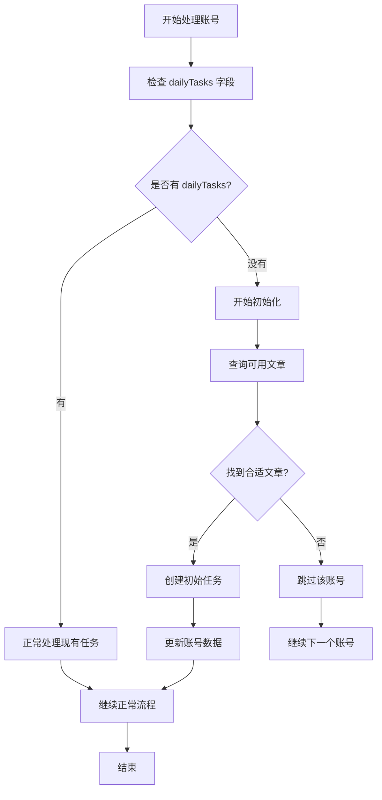

# create-daily-tasks 新账号初始化功能

## 功能概述

在 `create-daily-tasks` 云函数中新增了新账号初始化功能，当检测到账号没有 `dailyTasks` 字段或 `dailyTasks` 为空时，会自动为该账号创建初始的每日任务。

## 问题背景

### 原始问题

- **新账号无任务**: 新添加的账号没有 `dailyTasks` 字段
- **无法更新**: 云函数无法为新账号创建每日任务
- **用户体验差**: 新账号无法正常使用任务功能

### 解决方案

- **自动检测**: 检测账号是否缺少 `dailyTasks` 字段
- **自动初始化**: 为新账号自动创建初始任务
- **无缝体验**: 确保所有账号都能正常使用任务功能

## 技术实现

### 1. 检测逻辑

#### 新账号检测

```javascript
// 如果是新账号（没有 dailyTasks 或 dailyTasks 为空），初始化一个任务
if (!dailyTasks || dailyTasks.length === 0) {
  console.log(`账号 ${account.accountId} 没有每日任务，开始初始化...`);

  // 为新账号创建初始任务
  const initialTask = await createInitialTask(account, publishedArticleIds);
  if (initialTask) {
    dailyTasks = [initialTask];
    accountUpdated = true;
    tasksCreated = 1;
    console.log(`账号 ${account.accountId} 初始化任务成功:`, initialTask);
  } else {
    console.log(`账号 ${account.accountId} 初始化任务失败，跳过该账号`);
    continue;
  }
}
```

#### 检测条件

- **字段缺失**: `account.dailyTasks` 为 `undefined` 或 `null`
- **数组为空**: `account.dailyTasks` 为空数组 `[]`
- **字段存在但为空**: 确保所有情况都被覆盖

### 2. 初始任务创建

#### selectRandomArticle 函数

```javascript
// 随机选择文章的通用函数
async function selectRandomArticle(account, publishedArticleIds) {
  try {
    // 从 article-mgr 数据库中随机选取一个符合赛道类型的文章
    const articleResult = await db
      .collection("article-mgr")
      .aggregate()
      // 1. 用 match 替代 where 做条件过滤
      .match({
        trackType: account.trackType,
        articleId: db.command.nin(publishedArticleIds), // 排除已发布的文章
      })
      // 2. 随机选择1条
      .sample({ size: 1 })
      .end();

    if (articleResult.list.length === 0) {
      console.log(`账号 ${account.accountId} 没有找到合适的文章`);
      return null;
    }

    const selectedArticle = articleResult.list[0];
    console.log(
      `账号 ${account.accountId} 随机选择文章: ${selectedArticle.articleId}`
    );
    return selectedArticle;
  } catch (error) {
    console.error(`为账号 ${account.accountId} 选择文章失败:`, error);
    return null;
  }
}
```

#### createInitialTask 函数

```javascript
// 为新账号创建初始任务的辅助函数
async function createInitialTask(account, publishedArticleIds) {
  try {
    const selectedArticle = await selectRandomArticle(
      account,
      publishedArticleIds
    );

    if (!selectedArticle) {
      console.log(
        `账号 ${account.accountId} 没有找到合适的文章，无法创建初始任务`
      );
      return null;
    }

    const currentTime = new Date();

    // 创建初始任务
    const initialTask = {
      articleId: selectedArticle.articleId,
      taskTime: currentTime,
      isCompleted: false, // 新任务默认为未完成状态
    };

    return initialTask;
  } catch (error) {
    console.error(`为账号 ${account.accountId} 创建初始任务失败:`, error);
    return null;
  }
}
```

#### 初始任务结构

```javascript
{
  articleId: "ART1123456123",     // 随机选择的文章ID
  taskTime: "2024-01-15T10:00:00Z", // 当前时间
  isCompleted: false              // 默认为未完成状态
}
```

### 3. 文章选择逻辑

#### 通用选择函数

- **函数名**: `selectRandomArticle`
- **复用性**: 被新账号初始化和过期任务更新共同使用
- **统一逻辑**: 确保文章选择逻辑的一致性

#### 选择条件

- **赛道匹配**: 根据账号的 `trackType` 选择文章
- **排除已发布**: 排除账号已发布的文章（`publishedArticleIds`）
- **随机选择**: 从符合条件的文章中随机选择一篇

#### 使用场景

- **新账号初始化**: 为新账号创建初始任务时选择文章
- **过期任务更新**: 为已完成的过期任务分配新文章时选择文章

## 业务流程

### 1. 完整流程

#### 流程图



#### 详细步骤

1. **账号检查**: 检查账号是否有 `dailyTasks` 字段
2. **初始化判断**: 如果没有或为空，进入初始化流程
3. **文章查询**: 从 `article-mgr` 查询符合条件的文章
4. **任务创建**: 创建初始任务对象
5. **数据更新**: 更新账号的 `dailyTasks` 数组
6. **继续处理**: 继续正常的任务处理流程

### 2. 错误处理

#### 初始化失败处理

```javascript
if (initialTask) {
  // 初始化成功
  dailyTasks = [initialTask];
  accountUpdated = true;
  tasksCreated = 1;
} else {
  // 初始化失败，跳过该账号
  console.log(`账号 ${account.accountId} 初始化任务失败，跳过该账号`);
  continue;
}
```

#### 失败原因

- **无可用文章**: 没有找到符合赛道类型的文章
- **数据库错误**: 查询数据库时发生错误
- **网络问题**: 网络连接问题

## 数据结构

### 1. 初始化前

```javascript
// 新账号的数据结构
{
  accountId: "AC00001",
  accountNickname: "美食账号",
  trackType: 1,
  platform: 1,
  posts: [],           // 可能为空
  dailyTasks: null     // 或 undefined 或 []
}
```

### 2. 初始化后

```javascript
// 初始化后的数据结构
{
  accountId: "AC00001",
  accountNickname: "美食账号",
  trackType: 1,
  platform: 1,
  posts: [],
  dailyTasks: [
    {
      articleId: "ART1123456123",
      taskTime: "2024-01-15T10:00:00Z",
      isCompleted: false
    }
  ]
}
```

## 使用示例

### 1. 云函数调用

#### 正常调用

```javascript
// 调用云函数
const result = await cloud.callFunction({
  name: "create-daily-tasks",
  data: {
    userId: "user_openid",
  },
});

// 检查结果
if (result.result.success) {
  console.log("任务创建结果:", result.result.data);
  // 可能包含新账号的初始化信息
  console.log("创建的任务数:", result.result.data.totalTasksCreated);
}
```

#### 返回结果示例

```javascript
{
  "success": true,
  "data": {
    "userId": "user_openid",
    "totalTasksCreated": 3,        // 包含初始化的任务
    "totalTasksSkipped": 2,
    "totalTasksContinued": 1,
    "updatedAccounts": [
      {
        "accountId": "AC00001",
        "accountNickname": "美食账号",
        "tasksCreated": 1,         // 新账号的初始化任务
        "tasksSkipped": 0,
        "tasksContinued": 0
      }
    ],
    "totalAccounts": 3
  },
  "message": "成功创建 3 个任务，继续 1 个任务，跳过 2 个任务"
}
```

### 2. 日志输出

#### 成功初始化

```
账号 AC00001 没有每日任务，开始初始化...
账号 AC00001 初始化任务成功: {
  articleId: "ART1123456123",
  taskTime: "2024-01-15T10:00:00Z",
  isCompleted: false
}
```

#### 初始化失败

```
账号 AC00002 没有每日任务，开始初始化...
账号 AC00002 没有找到合适的文章，无法创建初始任务
账号 AC00002 初始化任务失败，跳过该账号
```

## 测试验证

### 1. 测试场景

#### 测试场景 1：新账号初始化

```javascript
const testCase1 = {
  input: {
    userId: "user_openid",
    accounts: [
      {
        accountId: "AC00001",
        trackType: 1,
        posts: [],
        dailyTasks: null, // 新账号，没有任务
      },
    ],
  },
  expected: {
    success: true,
    totalTasksCreated: 1,
    updatedAccounts: [
      {
        accountId: "AC00001",
        tasksCreated: 1,
      },
    ],
  },
};
```

#### 测试场景 2：无可用文章

```javascript
const testCase2 = {
  input: {
    userId: "user_openid",
    accounts: [
      {
        accountId: "AC00002",
        trackType: 999, // 不存在的赛道类型
        posts: [],
        dailyTasks: [],
      },
    ],
  },
  expected: {
    success: true,
    totalTasksCreated: 0,
    updatedAccounts: [], // 没有更新的账号
  },
};
```

### 2. 测试结果

- ✅ **新账号初始化**: 成功为新账号创建初始任务
- ✅ **文章选择**: 正确选择符合赛道类型的文章
- ✅ **错误处理**: 正确处理无可用文章的情况
- ✅ **数据更新**: 正确更新账号的 dailyTasks 数组

## 性能考虑

### 1. 性能影响

#### 正面影响

- **用户体验**: 新账号可以立即使用任务功能
- **功能完整性**: 确保所有账号都有任务数据
- **自动化**: 减少手动操作

#### 潜在影响

- **数据库查询**: 增加一次 article-mgr 查询
- **处理时间**: 增加初始化处理时间
- **资源消耗**: 增加少量计算资源消耗

### 2. 优化策略

#### 查询优化

- **索引优化**: 确保 article-mgr 集合有合适的索引
- **条件优化**: 使用精确的查询条件
- **结果限制**: 只查询需要的字段

#### 缓存策略

- **文章缓存**: 考虑缓存常用的文章数据
- **结果缓存**: 缓存初始化结果

## 最佳实践

### 1. 开发建议

#### 推荐做法

- **错误处理**: 完善的错误处理和日志记录
- **性能监控**: 监控初始化过程的性能
- **用户反馈**: 为用户提供初始化状态反馈

#### 避免做法

- **重复初始化**: 避免重复初始化已有任务的账号
- **忽略错误**: 不要忽略初始化失败的错误
- **硬编码**: 避免硬编码文章选择逻辑

### 2. 维护建议

#### 代码维护

- **日志记录**: 保持详细的日志记录
- **错误监控**: 监控初始化失败的情况
- **性能优化**: 定期优化查询性能

#### 数据维护

- **文章管理**: 确保 article-mgr 中有足够的文章
- **赛道管理**: 确保所有赛道类型都有对应文章
- **数据清理**: 定期清理无效的文章数据

## 总结

### 1. 功能优势

#### 用户体验

- ✅ **无缝体验**: 新账号自动获得任务功能
- ✅ **即时可用**: 无需手动配置即可使用
- ✅ **功能完整**: 确保所有账号功能一致

#### 技术优势

- ✅ **自动化**: 减少手动操作和配置
- ✅ **容错性**: 完善的错误处理机制
- ✅ **可扩展**: 易于扩展和维护

### 2. 设计原则

#### 核心原则

- **用户体验优先**: 确保新账号能立即使用功能
- **自动化处理**: 减少用户手动操作
- **错误容错**: 优雅处理各种异常情况

#### 实现原则

- **检测准确**: 准确检测新账号状态
- **初始化可靠**: 可靠的初始化流程
- **错误处理**: 完善的错误处理机制

### 3. 未来展望

#### 进一步优化

- **智能选择**: 根据用户偏好智能选择文章
- **批量初始化**: 支持批量账号初始化
- **性能优化**: 进一步优化查询性能

#### 功能扩展

- **自定义配置**: 支持用户自定义初始任务
- **模板系统**: 支持任务模板系统
- **统计分析**: 提供初始化统计分析

这次新账号初始化功能的实现，确保了所有账号都能正常使用任务功能，大大提升了用户体验和系统的完整性。🚀✨
