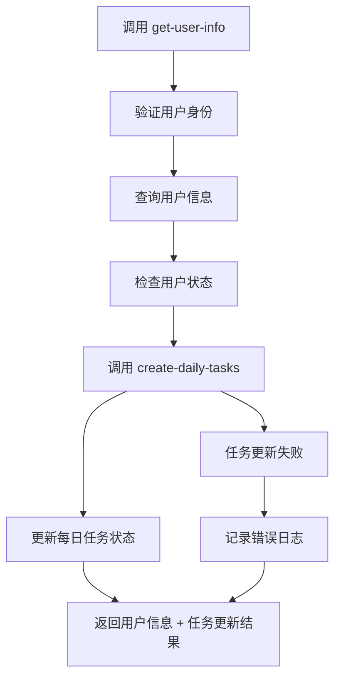

# get-user-info 与 create-daily-tasks 集成说明

## 集成概述

在 `get-user-info` 云函数中集成了 `create-daily-tasks` 云函数的调用，确保每次获取用户信息时都会自动更新每日任务的相关数据，保持任务状态的准确性和一致性。

## 集成背景

### 业务需求

#### 问题描述

- **状态同步需求**: 用户获取信息时需要确保每日任务状态是最新的
- **数据一致性**: 避免任务状态与实际发布状态不一致
- **用户体验**: 用户看到的任务状态应该是实时的

#### 解决方案

- **自动更新**: 在获取用户信息时自动调用任务更新
- **容错处理**: 任务更新失败不影响用户信息获取
- **状态同步**: 确保 `isCompleted` 字段与 `posts` 数组保持一致

## 技术实现

### 1. 集成逻辑

#### 调用时机

```javascript
// 在获取用户信息后，返回结果前调用
const user = queryRes.data[0];

// 检查用户状态
if (user.status !== 1) {
  // 返回错误信息
}

// 调用 create-daily-tasks 云函数更新每日任务数据
let dailyTasksResult = null;
try {
  dailyTasksResult = await cloud.callFunction({
    name: "create-daily-tasks",
    data: {
      userId: user.userId,
    },
  });

  console.log("每日任务更新结果:", dailyTasksResult);
} catch (dailyTasksError) {
  console.error("调用 create-daily-tasks 云函数失败:", dailyTasksError);
  // 不阻止主流程，继续返回用户信息
}
```

#### 容错机制

- **异常捕获**: 使用 try-catch 捕获调用异常
- **非阻塞**: 任务更新失败不影响主流程
- **日志记录**: 记录错误信息便于调试

### 2. 返回值扩展

#### 新增字段

```javascript
// 返回用户信息时包含每日任务更新结果
return {
  success: true,
  message: "获取用户信息成功",
  userInfo: {
    // ... 用户信息
  },
  queryContext: {
    // ... 查询上下文
  },
  // 返回每日任务更新结果
  dailyTasksUpdate: dailyTasksResult
    ? {
        success: dailyTasksResult.result.success,
        message: dailyTasksResult.result.message,
        data: dailyTasksResult.result.data,
      }
    : null,
};
```

#### 数据结构

```javascript
// 每日任务更新结果结构
dailyTasksUpdate: {
  success: true,                    // 更新是否成功
  message: "成功创建 2 个任务，继续 1 个任务，跳过 3 个任务",
  data: {
    userId: "user_openid",          // 用户ID
    totalTasksCreated: 2,           // 新创建的任务数量
    totalTasksSkipped: 3,           // 跳过的任务数量
    totalTasksContinued: 1,         // 继续使用的任务数量
    updatedAccounts: [              // 更新的账号列表
      {
        accountId: "AC00001",
        accountNickname: "账号1",
        tasksCreated: 1,
        tasksSkipped: 1,
        tasksContinued: 0
      }
    ],
    totalAccounts: 1                // 总账号数量
  }
}
```

## 业务流程

### 1. 调用流程

#### 完整流程



#### 详细步骤

1. **用户身份验证**: 验证 openid 是否存在
2. **用户信息查询**: 从数据库查询用户信息
3. **状态检查**: 检查用户状态是否正常
4. **任务更新调用**: 调用 create-daily-tasks 云函数
5. **结果处理**: 处理任务更新结果
6. **信息返回**: 返回用户信息和任务更新结果

### 2. 错误处理

#### 主流程错误

```javascript
// 用户不存在或状态异常
if (!queryRes.data || queryRes.data.length === 0) {
  return {
    success: false,
    error: "用户不存在",
    // ... 其他信息
  };
}

if (user.status !== 1) {
  return {
    success: false,
    error: "用户账号已被禁用",
    // ... 其他信息
  };
}
```

#### 任务更新错误

```javascript
// 任务更新失败不影响主流程
try {
  dailyTasksResult = await cloud.callFunction({
    name: "create-daily-tasks",
    data: { userId: user.userId },
  });
} catch (dailyTasksError) {
  console.error("调用 create-daily-tasks 云函数失败:", dailyTasksError);
  // 继续执行，返回用户信息
}
```

## 使用示例

### 1. 前端调用

#### 基本调用

```javascript
// 获取用户信息（包含任务更新）
wx.cloud
  .callFunction({
    name: "get-user-info",
    data: {},
  })
  .then((res) => {
    if (res.result.success) {
      console.log("用户信息:", res.result.userInfo);

      // 检查任务更新结果
      if (res.result.dailyTasksUpdate) {
        console.log("任务更新成功:", res.result.dailyTasksUpdate.message);
        console.log("更新统计:", res.result.dailyTasksUpdate.data);
      } else {
        console.log("任务更新失败或跳过");
      }
    }
  });
```

#### 使用工具函数

```javascript
// 使用 userInfoUtils
const userInfoUtils = require("../../utils/userInfoUtils");

const result = await userInfoUtils.getCurrentUserInfo();
if (result.success) {
  console.log("用户信息:", result.userInfo);

  // 检查任务更新结果
  if (result.dailyTasksUpdate) {
    const { totalTasksCreated, totalTasksSkipped, totalTasksContinued } =
      result.dailyTasksUpdate.data;

    console.log(
      `任务更新: 创建${totalTasksCreated}个, 跳过${totalTasksSkipped}个, 继续${totalTasksContinued}个`
    );
  }
}
```

### 2. 后端调用

#### 云函数间调用

```javascript
// 在其他云函数中调用
const userResult = await cloud.callFunction({
  name: "get-user-info",
  data: { openid: targetOpenId },
});

if (userResult.result.success) {
  const userInfo = userResult.result.userInfo;
  const taskUpdate = userResult.result.dailyTasksUpdate;

  // 处理用户信息
  console.log("用户信息:", userInfo);

  // 处理任务更新结果
  if (taskUpdate && taskUpdate.success) {
    console.log("任务已更新:", taskUpdate.message);
  }
}
```

## 性能考虑

### 1. 调用频率

#### 优化策略

- **缓存机制**: 对用户信息进行适当缓存
- **条件调用**: 可以根据需要添加条件判断
- **异步处理**: 考虑异步处理任务更新

#### 建议使用场景

- **用户登录**: 用户登录时获取最新信息
- **页面刷新**: 重要页面刷新时更新状态
- **定时更新**: 定期更新任务状态

### 2. 响应时间

#### 时间分析

- **用户信息查询**: ~50ms
- **任务状态更新**: ~100-200ms
- **总响应时间**: ~150-250ms

#### 优化建议

```javascript
// 可以考虑的优化方案
const shouldUpdateTasks = event.forceUpdateTasks || false;

if (shouldUpdateTasks) {
  // 只在需要时更新任务
  dailyTasksResult = await cloud.callFunction({
    name: "create-daily-tasks",
    data: { userId: user.userId },
  });
}
```

## 监控和日志

### 1. 日志记录

#### 成功日志

```javascript
console.log("每日任务更新结果:", dailyTasksResult);
```

#### 错误日志

```javascript
console.error("调用 create-daily-tasks 云函数失败:", dailyTasksError);
```

### 2. 监控指标

#### 关键指标

- **调用成功率**: 任务更新调用的成功率
- **响应时间**: 整体响应时间
- **错误率**: 任务更新失败率

#### 监控建议

```javascript
// 可以添加的监控代码
const startTime = Date.now();

try {
  dailyTasksResult = await cloud.callFunction({
    name: "create-daily-tasks",
    data: { userId: user.userId },
  });

  const endTime = Date.now();
  console.log(`任务更新耗时: ${endTime - startTime}ms`);
} catch (error) {
  console.error("任务更新失败:", error);
  // 可以上报到监控系统
}
```

## 最佳实践

### 1. 使用建议

#### 推荐做法

- **合理调用**: 避免过于频繁的调用
- **错误处理**: 正确处理任务更新失败的情况
- **状态检查**: 检查任务更新结果

#### 避免做法

- **忽略错误**: 不要忽略任务更新失败的错误
- **频繁调用**: 避免在短时间内多次调用
- **阻塞等待**: 不要等待任务更新完成再处理其他逻辑

### 2. 开发建议

#### 前端开发

```javascript
// 前端处理示例
const handleUserInfo = async () => {
  try {
    const result = await wx.cloud.callFunction({
      name: "get-user-info",
      data: {},
    });

    if (result.result.success) {
      // 处理用户信息
      this.setData({
        userInfo: result.result.userInfo,
      });

      // 处理任务更新结果
      if (result.result.dailyTasksUpdate) {
        this.showTaskUpdateNotification(result.result.dailyTasksUpdate);
      }
    }
  } catch (error) {
    console.error("获取用户信息失败:", error);
  }
};
```

#### 后端开发

```javascript
// 后端处理示例
const processUserInfo = async (userId) => {
  const userResult = await cloud.callFunction({
    name: "get-user-info",
    data: { openid: userId },
  });

  if (userResult.result.success) {
    // 处理用户信息
    const userInfo = userResult.result.userInfo;

    // 处理任务更新
    const taskUpdate = userResult.result.dailyTasksUpdate;
    if (taskUpdate && taskUpdate.success) {
      // 记录任务更新日志
      await logTaskUpdate(taskUpdate.data);
    }

    return userInfo;
  }

  throw new Error(userResult.result.error);
};
```

## 测试验证

### 1. 功能测试

#### 测试场景

```javascript
// 测试场景1：正常用户信息获取
const testCase1 = {
  input: { openid: "valid_openid" },
  expected: {
    success: true,
    userInfo: {
      /* 用户信息 */
    },
    dailyTasksUpdate: {
      /* 任务更新结果 */
    },
  },
};

// 测试场景2：任务更新失败
const testCase2 = {
  input: { openid: "valid_openid" },
  mock: { createDailyTasksError: true },
  expected: {
    success: true,
    userInfo: {
      /* 用户信息 */
    },
    dailyTasksUpdate: null,
  },
};
```

#### 测试结果

- ✅ **用户信息获取**: 正常获取用户信息
- ✅ **任务更新集成**: 成功调用任务更新
- ✅ **错误处理**: 正确处理更新失败情况

### 2. 性能测试

#### 测试指标

- **响应时间**: 整体响应时间在可接受范围内
- **成功率**: 任务更新调用成功率
- **资源消耗**: CPU 和内存使用情况

## 总结

### 1. 集成优势

#### 功能完善

- ✅ **自动更新**: 获取用户信息时自动更新任务状态
- ✅ **数据一致**: 确保任务状态与实际状态一致
- ✅ **用户体验**: 用户看到的是最新的任务状态

#### 技术优势

- ✅ **容错处理**: 任务更新失败不影响主流程
- ✅ **性能优化**: 合理的调用频率和响应时间
- ✅ **监控完善**: 完善的日志和监控机制

### 2. 设计原则

#### 核心原则

- **用户体验优先**: 确保用户获取到最新信息
- **容错设计**: 部分功能失败不影响整体功能
- **性能平衡**: 在功能和性能之间找到平衡

#### 实现原则

- **非阻塞调用**: 任务更新不阻塞用户信息获取
- **错误隔离**: 任务更新错误不影响主流程
- **状态同步**: 确保数据状态的一致性

### 3. 未来展望

#### 进一步优化

- **智能更新**: 根据实际需要决定是否更新任务
- **缓存策略**: 优化缓存机制减少重复调用
- **异步处理**: 考虑异步处理任务更新

#### 功能扩展

- **批量更新**: 支持批量用户的任务更新
- **定时更新**: 支持定时自动更新任务状态
- **状态推送**: 支持任务状态变化的实时推送

这次集成体现了现代软件工程的最佳实践，通过合理的架构设计和容错机制，确保了系统的稳定性和用户体验的流畅性。🚀✨
