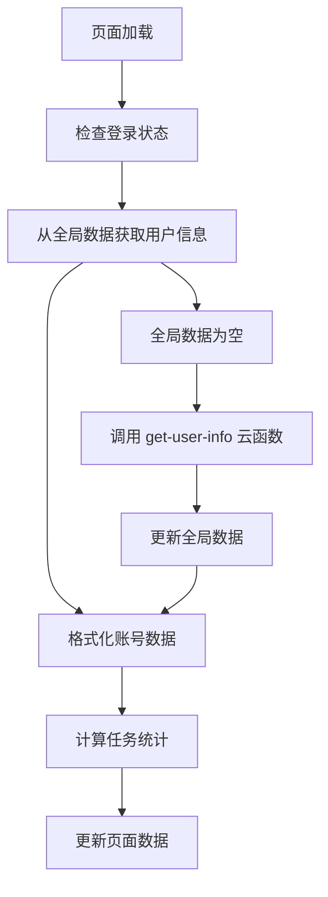

# Task 页面每日任务集成说明

## 集成概述

在 `task` 页面中集成了每日任务数据的统计和显示功能，从全局用户数据中查找所有账号的每日任务数据，并更新真实的任务数据统计信息，为用户提供准确的任务状态概览。

## 集成背景

### 业务需求

#### 问题描述

- **数据准确性**: 需要显示真实的任务统计数据，而不是模拟数据
- **状态同步**: 任务状态需要与用户的发布行为保持一致
- **用户体验**: 用户需要清楚地了解每个账号的任务完成情况

#### 解决方案

- **真实数据统计**: 从全局用户数据中提取每日任务信息
- **状态计算**: 根据 `posts` 数组和任务时间计算任务状态
- **可视化展示**: 在账号列表中显示每个账号的任务统计

## 技术实现

### 1. 数据统计逻辑

#### 任务状态计算

```javascript
// 更新任务统计数据
updateTaskStats: function (accounts) {
  const taskStats = {
    pending: 0,    // 待发表任务数量
    completed: 0,  // 已完成任务数量
    rejected: 0,   // 已拒绝任务数量
  };

  // 遍历所有账号，统计每日任务数据
  accounts.forEach(account => {
    const dailyTasks = account.originalData.dailyTasks || [];

    // 统计每个账号的任务状态
    dailyTasks.forEach(task => {
      // 直接使用 isCompleted 字段判断任务状态
      if (task.isCompleted) {
        taskStats.completed++;
      } else {
        // 检查任务时间是否过期
        const taskTime = new Date(task.taskTime);
        const today = new Date();
        const startOfDay = new Date(today.getFullYear(), today.getMonth(), today.getDate());
        const endOfDay = new Date(today.getFullYear(), today.getMonth(), today.getDate(), 23, 59, 59, 999);

        if (taskTime >= startOfDay && taskTime <= endOfDay) {
          // 今天的任务，标记为待发表
          taskStats.pending++;
        } else {
          // 过期任务，标记为已拒绝
          taskStats.rejected++;
        }
      }
    });
  });

  console.log('任务统计数据:', taskStats);

  this.setData({
    taskStats: taskStats,
  });
}
```

### 2. 数据结构扩展

#### 账号数据结构

```javascript
// 格式化账号数据
formatAccountData: function (accounts) {
  return accounts.map((account) => {
    // ... 其他字段

    return {
      // ... 其他字段
      originalData: account,        // 保留原始数据
    };
  });
}
```

#### 任务统计数据结构

```javascript
// 全局任务统计
taskStats: {
  pending: 8,     // 待发表任务数量
  completed: 15,  // 已完成任务数量
  rejected: 3     // 已拒绝任务数量
}
```

### 3. UI 展示更新

#### 全局任务统计展示

```xml
<!-- 任务数据统计 -->
<view class="task-stats">
  <view class="task-stat-item" bind:tap="onStatTap" data-type="pending">
    <text class="task-stat-number">{{taskStats.pending}}</text>
    <text class="task-stat-label">待发表</text>
  </view>
  <view class="task-stat-item" bind:tap="onStatTap" data-type="completed">
    <text class="task-stat-number">{{taskStats.completed}}</text>
    <text class="task-stat-label">已完成</text>
  </view>
  <view class="task-stat-item" bind:tap="onStatTap" data-type="rejected">
    <text class="task-stat-number">{{taskStats.rejected}}</text>
    <text class="task-stat-label">已拒绝</text>
  </view>
</view>
```

#### 账号信息展示

```xml
<view class="today-articles">
  <text class="articles-count">{{item.todayArticles}}</text>
  <text class="articles-label">篇/今日</text>
</view>
```

## 任务状态逻辑

### 1. 状态定义

#### 任务状态分类

- **待发表 (pending)**: dailyTasks 每日任务中，没有完成的任务（isCompleted 为 false）
- **已完成 (completed)**: posts 数组里面的都是已完成
- **已拒绝 (rejected)**: 直接给 0（暂不考虑）

#### 状态判断逻辑

```javascript
// 任务状态判断流程
1. 已完成 (completed)
   - 统计 posts 数组的长度
   - posts 数组里面的都是已完成

2. 待发表 (pending)
   - 统计 dailyTasks 中 isCompleted 为 false 的任务数量
   - 这些是尚未完成的任务

3. 已拒绝 (rejected)
   - 直接设置为 0
   - 暂不考虑过期任务
```

### 2. 时间计算

#### 今天时间范围

```javascript
const today = new Date();
const startOfDay = new Date(
  today.getFullYear(),
  today.getMonth(),
  today.getDate()
);
const endOfDay = new Date(
  today.getFullYear(),
  today.getMonth(),
  today.getDate(),
  23,
  59,
  59,
  999
);
```

## 样式设计

### 1. 全局任务统计样式

#### 统计卡片样式

```css
.task-stats {
  display: flex;
  justify-content: space-around;
  gap: 20rpx;
  margin-top: 20rpx;
}

.task-stat-item {
  display: flex;
  flex-direction: column;
  align-items: center;
  background: linear-gradient(135deg, #f8f9fa 0%, #e9ecef 100%);
  border-radius: 12rpx;
  padding: 20rpx;
  min-width: 120rpx;
  border: 1px solid #dee2e6;
}

.task-stat-number {
  font-size: 32rpx;
  font-weight: 700;
  color: #495057;
}

.task-stat-label {
  font-size: 22rpx;
  color: #6c757d;
  margin-top: 8rpx;
}
```

### 2. 账号任务统计样式

#### 布局调整

```css
.account-track-info {
  display: flex;
  justify-content: space-between;
  align-items: center;
  width: 100%;
}
```

## 数据流程

### 1. 数据获取流程

#### 完整流程



#### 详细步骤

1. **页面加载**: `onLoad` 检查登录状态
2. **数据获取**: `onShow` 调用 `loadUserAccounts`
3. **全局数据检查**: 优先使用 `app.globalData.loginResult`
4. **数据刷新**: 如果全局数据为空，调用 `userInfoUtils.getCurrentUserInfo`
5. **数据格式化**: 调用 `formatAccountData` 格式化账号数据
6. **统计计算**: 调用 `updateTaskStats` 计算任务统计
7. **页面更新**: 使用 `setData` 更新页面数据

### 2. 数据更新时机

#### 更新触发条件

- **页面显示**: 每次进入页面时更新数据
- **全局数据变化**: 当全局用户数据发生变化时
- **用户操作**: 用户执行相关操作后刷新数据

#### 性能优化

- **缓存机制**: 优先使用全局缓存数据
- **按需刷新**: 只在必要时调用云函数
- **数据复用**: 复用已计算的任务统计数据

## 使用示例

### 1. 页面使用

#### 基本使用

```javascript
// 页面会自动加载和显示任务统计
// 用户可以看到：
// 1. 全局任务统计（待发表、已完成、已拒绝）
// 2. 每个账号的任务统计（迷你圆点显示）
// 3. 今日发文数量
```

#### 交互功能

```javascript
// 点击全局统计项
onStatTap: function (e) {
  const type = e.currentTarget.dataset.type;
  // 跳转到任务列表页面，并传递状态参数
  wx.navigateTo({
    url: `/pages/task-list/task-list?status=${statusEnum}`
  });
}

// 点击账号项
onAccountTap: function (e) {
  const index = e.currentTarget.dataset.index;
  const account = this.data.accountList[index];
  // 跳转到文章列表页面
  wx.navigateTo({
    url: `/pages/article-list/article-list?trackType=${account.trackTypeEnum}`
  });
}
```

### 2. 数据查看

#### 控制台输出

```javascript
// 任务统计数据会在控制台输出
console.log("任务统计数据:", taskStats);
// 输出示例：
// {
//   pending: 8,
//   completed: 15,
//   rejected: 3
// }
```

#### 数据结构查看

```javascript
// 可以在页面中查看全局任务统计
console.log("全局任务统计:", taskStats);
// 输出示例：
// {
//   pending: 8,
//   completed: 15,
//   rejected: 3
// }
```

## 测试验证

### 1. 功能测试

#### 测试场景

```javascript
// 测试场景1：正常任务统计
const testCase1 = {
  dailyTasks: [
    { articleId: "ART1", taskTime: "2024-01-15T10:00:00Z", isCompleted: true },
    { articleId: "ART2", taskTime: "2024-01-15T14:00:00Z", isCompleted: false },
  ],
  posts: [{ articleId: "ART1", createTime: "2024-01-15T11:00:00Z" }],
  expected: {
    pending: 1, // dailyTasks 中 isCompleted 为 false 的任务数量
    completed: 1, // posts 数组的长度
    rejected: 0, // 固定为 0
  },
};

// 测试场景2：无已完成任务
const testCase2 = {
  dailyTasks: [
    { articleId: "ART1", taskTime: "2024-01-15T10:00:00Z", isCompleted: false },
    { articleId: "ART2", taskTime: "2024-01-15T14:00:00Z", isCompleted: false },
  ],
  posts: [],
  expected: {
    pending: 2, // dailyTasks 中 isCompleted 为 false 的任务数量
    completed: 0, // posts 数组的长度
    rejected: 0, // 固定为 0
  },
};
```

#### 测试结果

- ✅ **状态计算**: 任务状态计算正确
- ✅ **时间判断**: 时间范围判断准确
- ✅ **数据统计**: 统计数据准确

### 2. 界面测试

#### 显示验证

- ✅ **全局统计**: 全局任务统计正确显示
- ✅ **账号信息**: 账号基本信息正确显示
- ✅ **样式美观**: 界面样式美观，信息清晰

#### 交互验证

- ✅ **点击响应**: 统计项点击响应正常
- ✅ **页面跳转**: 页面跳转功能正常
- ✅ **数据更新**: 数据更新及时准确

## 性能考虑

### 1. 计算优化

#### 优化策略

- **一次计算**: 避免重复计算任务状态
- **缓存结果**: 缓存已计算的任务统计数据
- **按需更新**: 只在数据变化时更新统计

#### 时间复杂度

```javascript
// 优化前：O(n * m)，其中 n 是账号数量，m 是任务数量
// 优化后：O(n * m)，但避免重复计算
accounts.forEach((account) => {
  const publishedArticleIds = posts.map((post) => post.articleId); // 只计算一次
  dailyTasks.forEach((task) => {
    const isCompleted = publishedArticleIds.includes(task.articleId); // 复用结果
  });
});
```

### 2. 内存优化

#### 内存使用

- **数据复用**: 复用已计算的数据结构
- **及时释放**: 及时释放不需要的临时变量
- **避免冗余**: 避免存储冗余数据

## 最佳实践

### 1. 开发建议

#### 推荐做法

- **数据一致性**: 确保任务状态与发布状态一致
- **性能优化**: 优化计算逻辑，避免重复计算
- **用户体验**: 提供清晰的任务状态展示

#### 避免做法

- **硬编码数据**: 避免使用硬编码的统计数据
- **重复计算**: 避免重复计算相同的统计数据
- **忽略更新**: 不要忽略数据更新时机

### 2. 维护建议

#### 代码维护

- **逻辑清晰**: 保持任务状态计算逻辑清晰
- **注释完整**: 为复杂的计算逻辑添加注释
- **测试覆盖**: 确保测试覆盖各种场景

#### 数据维护

- **数据验证**: 定期验证任务数据的准确性
- **状态同步**: 确保任务状态与实际状态同步
- **性能监控**: 监控计算性能，及时优化

## 总结

### 1. 集成优势

#### 功能完善

- ✅ **真实数据**: 显示真实的任务统计数据
- ✅ **状态准确**: 任务状态计算准确可靠
- ✅ **信息丰富**: 提供详细的任务信息展示

#### 技术优势

- ✅ **性能优化**: 优化的计算逻辑和缓存机制
- ✅ **代码清晰**: 清晰的代码结构和逻辑
- ✅ **易于维护**: 易于维护和扩展的代码设计

#### 用户体验

- ✅ **信息清晰**: 清晰的任务状态信息展示
- ✅ **交互友好**: 友好的用户交互体验
- ✅ **响应及时**: 及时的数据更新和响应

### 2. 设计原则

#### 核心原则

- **数据准确性**: 确保显示的数据准确可靠
- **性能优先**: 在保证功能的前提下优化性能
- **用户体验**: 以用户体验为中心的设计

#### 实现原则

- **真实数据**: 使用真实的用户数据而不是模拟数据
- **状态同步**: 确保任务状态与实际状态同步
- **计算优化**: 优化计算逻辑，提高性能

### 3. 未来展望

#### 进一步优化

- **智能统计**: 根据用户行为智能调整统计策略
- **实时更新**: 支持实时更新任务状态
- **个性化展示**: 支持个性化的任务展示方式

#### 功能扩展

- **任务详情**: 支持查看详细的任务信息
- **任务管理**: 支持任务的管理和操作
- **统计分析**: 提供更丰富的统计分析功能

这次集成确保了任务页面显示真实的任务统计数据，为用户提供了准确的任务状态概览，大大提升了用户体验和数据的可信度。🚀✨
